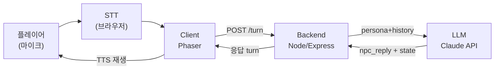

# 보이스 협상 게임 — 설계 문서

Phaser 기반, 음성으로 NPC와 협상하고 대화가 끝나면 발화 스타일을 분석해 보여주는 게임.
4주 완성을 목표로 하는 MVP 범위 기준이며, **기획 / 프론트엔드 / 백엔드 3인 역할 분담을 전제로** 작성했습니다. 스테이지 3개(=NPC 3명) 구성으로 확정합니다.

---

## 1. 팀 역할 분담

| 영역 | 담당 | 폴더 |
|---|---|---|
| 기획 (스테이지·NPC 페르소나 설계, 밸런스, 리포트 문구) | 기획 담당 | `server/src/data/npcPersonas/*.json` |
| 프론트엔드 (Phaser 클라이언트, 음성 입출력, UI) | 프론트 담당 | `client/` |
| 백엔드 (엔진, LLM 연동, 판정, 분석 로직) | 백엔드 담당 | `server/src/` (data 폴더 제외) |
| 공유 타입 정의 | 공동 | `shared/` |

세 사람이 동시에 작업하려면 서로의 결과물을 몰라도 붙을 수 있어야 합니다. NPC를 코드가 아니라 JSON으로 정의해둔 설계가 여기서 힘을 발휘합니다 — 기획 담당이 엔진 코드를 전혀 몰라도 `npcPersonas/` 폴더에 파일 하나를 추가하는 것만으로 새 스테이지를 만들 수 있습니다. **2장(아키텍처), 4장(스테이지 구성), 5장(API 계약)**의 인터페이스만 지키면 세 역할이 서로 기다리지 않고 병렬로 진행됩니다.

---

## 2. 핵심 루프

1. 플레이어가 마이크에 대고 말한다
2. 브라우저 STT가 텍스트로 바꾼다 (프론트)
3. 프론트가 텍스트를 백엔드로 보낸다
4. 백엔드가 NPC 페르소나 + 지금까지의 대화를 LLM에 넣고, 구조화된 응답(대사 + 협상 상태)을 받는다
5. 프론트가 그 응답으로 화면을 갱신하고 NPC 대사를 TTS로 재생한다
6. 협상이 끝나면(성공/결렬) 전체 대화 로그를 다시 백엔드로 보내 발화 스타일을 분석하고, 그 결과를 리포트 화면에 보여준다



**설계 원칙**: 협상 성공/실패를 판정하는 로직(턴마다 실시간)과, 대화가 끝난 뒤 말투를 분석하는 로직(세션 종료 후 1회)은 타이밍이 완전히 다르므로 별개 모듈로 분리합니다. 판정 로직은 LLM 호출에 얹지 않고 서버의 결정적 코드로 계산합니다 — 같은 조건이면 같은 결과가 나와야 하기 때문입니다.

---

## 3. Phaser 씬 구조 (프론트 담당)

| 씬 | 역할 | 비고 |
|---|---|---|
| BootScene | 폰트/설정 로드, 마이크 권한 사전 체크 | |
| PreloadScene | NPC 초상화·배경·효과음 로드 | |
| MainMenuScene | 스테이지 선택 (`GET /api/stages` 목록 표시) | NPC 3명 = 스테이지 3개, 난이도 순 진행 |
| NegotiationScene | 실시간 협상 — 마이크 버튼, 자막, 협상 게이지 | 백엔드 `/api/negotiation/turn` 호출 |
| ResultScene | 협상 성공/실패, 최종 조건 요약 | |
| StyleReportScene | 발화 스타일 리포트 — 지표 차트, 인용구 | 백엔드 `/api/analysis/style` 호출, 1~2초 지연 있음 |

ResultScene과 StyleReportScene을 나눈 이유: 스타일 분석은 LLM을 한 번 더 호출해서 즉시 안 나옵니다. 협상 결과부터 바로 보여주고, "말투 리포트 보기" 버튼으로 다음 씬을 별도 로딩하는 게 체감상 낫습니다.

---

## 4. 핵심 설계 결정 (백엔드 담당)

### NPC는 데이터로 정의한다

NPC 성격·목표·말투는 코드가 아니라 JSON 페르소나 파일로 둡니다. 새 NPC 추가 시 코드를 건드리지 않습니다.

```json
// server/src/data/npcPersonas/merchant_kim.json
{
  "id": "merchant_kim",
  "name": "김상인",
  "tone": "무뚝뚝하지만 정중한 존댓말",
  "goal": { "item": "골동품 화병", "floorPrice": 80000, "targetPrice": 120000 },
  "resistancePoints": [
    "가격을 세 번 이상 깎으려 하면 방어적으로 변함",
    "반말을 쓰면 신뢰도가 즉시 하락함"
  ],
  "successCriteria": "최종가가 floorPrice 이상이고 trust >= 40"
}
```

### 스테이지 구성 (3개, 기획 담당 확정)

스테이지 = NPC 1명. 난이도는 별도 시스템 없이 **스테이지 자체가 난이도 곡선**을 대신합니다. 아래는 기획 담당이 채울 예시이며, 세 파일이 각각 독립적이라 순서를 정하는 것 외에는 서로 영향을 주지 않습니다.

| 스테이지 | NPC | 컨셉 (예시) | 난이도 |
|---|---|---|---|
| 1 | 시장 상인 김씨 | 친절하지만 흥정을 좋아함 — 연습용 | 쉬움 |
| 2 | 중고차 딜러 박씨 | 가격+옵션 두 가지를 동시에 협상해야 함 | 보통 |
| 3 | 계약 담당자 이변호사 | 논리적이고 잘 안 물러남, 근거 없는 요청엔 신뢰도 급락 | 어려움 |

`server/src/data/npcPersonas/`에 `merchant_kim.json`, `car_dealer_park.json`, `lawyer_lee.json` 세 파일로 존재하고, 엔진(`negotiationEngine.ts`, `llmService.ts`)은 이 파일을 몇 개 만들든 코드 변경 없이 그대로 동작해야 합니다 — 그래야 기획 담당이 백엔드를 기다리지 않고 3개를 병렬로 채울 수 있습니다.

### 협상 상태는 매 턴 구조화된 값으로 갱신한다

LLM이 자연어만 뱉으면 성공/실패를 코드로 판정할 수 없습니다. NPC 대사와 함께 `trust`, `priceGap`, `stage` 같은 필드를 매 응답에 강제로 포함시키고, 게임 로직은 이 숫자만 보고 진행 상황을 판단합니다. (형식은 5장 API 계약 참고)

### 대화 로그는 그 자체로 게임 데이터다

매 턴을 `{speaker, text, timestampMs}` 형태로 세션에 누적합니다. 이 로그가 협상 판정과 스타일 분석 양쪽에서 재사용되는 단일 소스입니다.

---

## 5. API 계약 (프론트 ↔ 백엔드)

프론트와 백엔드가 각자 만들다가 마지막에 붙이면 어긋나기 쉽습니다. 아래 스펙을 먼저 고정해두고, 백엔드가 아직 없을 때는 프론트가 이 형식대로 더미 응답을 만들어 붙여보는 식으로 병렬 진행하세요.

### `GET /api/stages`

MainMenuScene에서 스테이지 목록을 그릴 때 호출. `npcPersonas/`에 파일이 몇 개 있든 이 목록에 자동으로 반영됩니다.

```json
// Response
[
  { "stageId": 1, "npcId": "merchant_kim", "name": "시장 상인 김씨", "difficulty": "easy" },
  { "stageId": 2, "npcId": "car_dealer_park", "name": "중고차 딜러 박씨", "difficulty": "normal" },
  { "stageId": 3, "npcId": "lawyer_lee", "name": "계약 담당자 이변호사", "difficulty": "hard" }
]
```

### `POST /api/negotiation/start`

세션 시작. NPC의 첫 대사를 받는다.

```json
// Request
{ "npcId": "merchant_kim" }

// Response
{
  "sessionId": "sess_ab12",
  "npcReply": "어서 오세요. 오늘은 뭘 보러 오셨나요?",
  "stage": "opening",
  "trust": 50,
  "priceGap": 40000,
  "dealClosed": false
}
```

### `POST /api/negotiation/turn`

플레이어 발화 1턴 처리.

```json
// Request
{
  "sessionId": "sess_ab12",
  "playerText": "그 가격은 너무 비싸요, 조금만 깎아주세요"
}

// Response
{
  "npcReply": "음... 그 가격은 좀 어렵겠는데요.",
  "stage": "bargaining",
  "trust": 34,
  "priceGap": 25000,
  "dealClosed": false
}
```

`dealClosed: true`가 오면 프론트는 더 이상 턴을 보내지 않고 ResultScene으로 전환합니다.

### `POST /api/analysis/style`

세션 종료 후 발화 스타일 분석.

```json
// Request
{ "sessionId": "sess_ab12" }

// Response
{
  "metrics": {
    "formality": 72,
    "directness": 45,
    "hedging": 30,
    "avgTurnLength": 8.4,
    "questionRatio": 22
  },
  "tactics": ["앵커링", "근거제시"],
  "summary": "당신은 대체로 정중한 존댓말을 썼지만, 가격 제안을 할 때마다 '혹시', '괜찮으시면' 같은 완곡 표현을 반복해서 협상력이 약해 보였습니다.",
  "highlights": [
    { "quote": "혹시 조금만 깎아주실 수 있을까요?", "note": "완곡한 요청 표현" }
  ]
}
```

`metrics`는 0~100 스케일 숫자만 담아 프론트에서 바로 레이더 차트에 꽂을 수 있게 합니다.

---

## 6. 발화 스타일 분석 지표 (백엔드 담당)

| 지표 | 측정 방식 | 우선순위 |
|---|---|---|
| 격식도 | 존댓말/반말 어미 비율 | 1주차부터 (정규식) |
| 직접성 | 요청문 vs 완곡 표현 비율 | 1주차부터 (정규식) |
| 헤징/필러 | "음", "그", "저기" 등 빈도 | 1주차부터 (정규식) |
| 평균 발화 길이 | 턴당 어절 수 | 1주차부터 (계산) |
| 질문 비율 | 의문문 비율 | 1주차부터 (정규식) |
| 설득 전략 태그 / summary / highlights | LLM 라벨링 + 요약 | 시간 남으면 추가 |

정교한 한국어 형태소 분석기를 붙일 시간은 없다고 가정합니다. 정규식 패턴으로 타협하고, 부족한 정밀도는 LLM 정성 요약으로 보완합니다.

---

## 7. 기술적 유의사항

- **API 키는 반드시 백엔드 뒤에.** 클라이언트에서 Claude API를 직접 호출하지 않습니다.
- **STT는 Web Speech API로 고정.** 크롬 기준으로만 먼저 검증하고, 다른 브라우저 대응은 이번 범위에서 뺍니다.
- **지연시간.** STT → LLM → TTS 왕복이 1초를 넘으면 어색해집니다. NPC "생각 중" 모션으로 지연을 가려주세요.
- **판정은 서버의 결정적 코드로.** LLM은 `trust`, `priceGap` 같은 재료 값만 제공하고, 최종 성공/실패 판정은 `negotiationEngine.ts`가 계산합니다.
- **음성 원본은 저장하지 않음.** STT 결과 텍스트만 세션에 남깁니다.

---

## 8. 폴더 구조

```
voice-negotiation-game/
├── client/                          # 프론트엔드 (Phaser)
│   ├── src/
│   │   ├── main.ts
│   │   ├── config/gameConfig.ts
│   │   ├── scenes/
│   │   │   ├── BootScene.ts
│   │   │   ├── PreloadScene.ts
│   │   │   ├── MainMenuScene.ts
│   │   │   ├── NegotiationScene.ts
│   │   │   ├── ResultScene.ts
│   │   │   └── StyleReportScene.ts
│   │   ├── entities/ (NPC.ts, Player.ts)
│   │   ├── ui/ (DialogueBox.ts, MicButton.ts, NegotiationMeter.ts, StyleRadarChart.ts)
│   │   ├── systems/
│   │   │   ├── VoiceInputManager.ts       # 마이크 캡처 + STT
│   │   │   ├── TTSManager.ts              # NPC 음성 출력
│   │   │   ├── DialogueSessionManager.ts  # 턴 기록, 세션 상태
│   │   │   └── ApiClient.ts               # 백엔드 통신 (5장 계약대로)
│   │   └── types/
│   ├── public/assets/ (images/npc-portraits/, audio/)
│   ├── index.html
│   └── package.json
│
├── server/                          # 백엔드
│   ├── src/
│   │   ├── index.ts
│   │   ├── routes/
│   │   │   ├── negotiation.ts       # /api/negotiation/start, /turn
│   │   │   └── styleAnalysis.ts     # /api/analysis/style
│   │   ├── services/
│   │   │   ├── llmService.ts        # Claude API 래퍼
│   │   │   ├── npcPersonaService.ts
│   │   │   ├── negotiationEngine.ts # 성공/실패 결정적 판정
│   │   │   └── styleAnalyzer.ts     # 규칙 기반 + LLM 분석
│   │   ├── data/npcPersonas/        # 기획 담당 전담 폴더
│   │   │   ├── merchant_kim.json    # 스테이지 1
│   │   │   ├── car_dealer_park.json # 스테이지 2
│   │   │   └── lawyer_lee.json      # 스테이지 3
│   │   └── models/ (session.ts, turn.ts)
│   ├── .env.example
│   └── package.json
│
├── shared/                          # 공유 타입 (5장 API 계약 반영)
│   └── types/ (negotiationTypes.ts, styleReportTypes.ts)
│
├── docs/
│   └── design-doc.md                # 이 문서
│
└── README.md
```

---

## 9. 4주 실행 계획

| 주차 | 기획 담당 | 백엔드 담당 | 프론트 담당 | 이번 주 목표 |
|---|---|---|---|---|
| 1주 | 3개 스테이지 난이도 곡선 확정, 스테이지 1(`merchant_kim.json`) 초안 작성 | Express 서버 골격, `/stages`·`/start`·`/turn` 라우트(더미 응답 가능), `.env` 설정 | Phaser 씬 4개 골격, 마이크 권한 처리, 백엔드 더미 응답으로 화면 붙여보기 | 파이프라인이 "말이 되든 안되든" 끝까지 한 번 붙는다 |
| 2주 | 스테이지 2·3 페르소나 JSON 작성, NPC별 대사 톤 가이드 | Claude API 실제 연동, JSON 스키마 강제(structured output), `negotiationEngine.ts` 판정 로직 | STT 연동, TTS 재생, NegotiationScene UI(마이크 버튼·자막·협상 게이지) | 협상 상태가 실제 게임 진행을 바꾸고, NPC 응답이 음성으로 나온다 |
| 3주 | 발화 스타일 리포트 문구/카피 작성, 스테이지별 QA 시나리오 작성 | `styleAnalyzer.ts`(규칙 기반 지표 먼저), `/api/analysis/style` | StyleReportScene(레이더 차트), ResultScene 마무리 | 협상이 끝나면 대화 전체를 분석한 리포트가 뜬다 |
| 4주 | 3개 스테이지 전체 플레이테스트 참여, 밸런스(가격·저항 포인트) 피드백 | 함께: 통합 테스트, NPC 프롬프트 밸런스 튜닝, 버그 픽스, 배포 빌드 | 함께: 통합 테스트, 버그 픽스 | 새 기능 추가 없이 깨지는 지점만 고친다 |

**스테이지가 3개로 늘어난 대신, 1개월 안에 끝내기 위해 계속 잘라내는 것**: STT·TTS는 브라우저 내장 그대로(클라우드 전환 없음) / 세션 히스토리·비교 기능 없음 / 별도 난이도 조절 시스템 없음(스테이지 자체가 난이도 역할) / 스테이지 간 분기 없이 1→2→3 선형 진행만. NPC를 데이터(JSON)로 분리해둔 덕에 3명으로 늘어나도 엔진 작업량은 거의 늘지 않고, 늘어나는 건 기획의 콘텐츠 작성과 4주차 플레이테스트 범위입니다.
